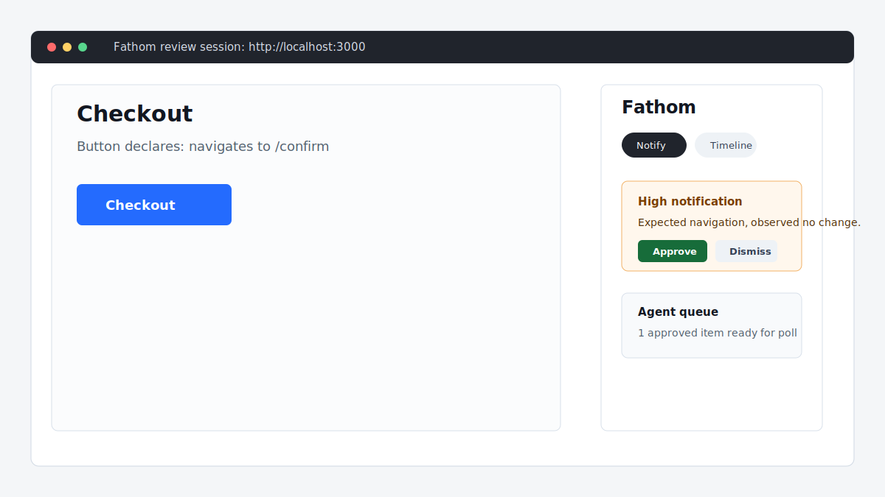

# Fathom

[](https://github.com/npkriami18/vessel-fathom/actions/workflows/ci.yml)
[](https://www.npmjs.com/package/vessel-fathom)
[](LICENSE)

Fathom is a local-first interaction verification loop for agent-built web apps. It is the sibling next step to `lavish-axi`: after an agent can show rich UI work for review, Fathom watches the real browser for dead buttons, silent wrong behavior, console errors, and mismatches against `data-fathom-expect` so approved human feedback can flow back to the agent with evidence.

## Quickstart

Install the agent skill:

```sh
npx skills add npkriami18/vessel-fathom --skill fathom
```

Or use the CLI without installing anything globally:

```sh
npx vessel-fathom open http://localhost:3000
```

The app must already be running. Fathom starts a localhost review chrome, proxies the app page, injects the observer SDK, and records interaction evidence under `~/.fathom/`.

## Visual Tour



The timeline shows observed interactions. Open notifications can be approved into the agent queue or dismissed as not actionable. `notify` inspects open notifications; `poll` drains approved feedback for the agent.

## CLI Reference

| Command                  | Purpose                                                         |
| ------------------------ | --------------------------------------------------------------- |
| `fathom open <url>`      | Create or resume a review session for a live app URL.           |
| `fathom notify <origin>` | List open notifications without consuming approved queue items. |
| `fathom poll <origin>`   | Drain approved human feedback for the agent.                    |
| `fathom end <origin>`    | Mark the review session finished.                               |
| `fathom export <origin>` | Write JSON and HTML reports under `~/.fathom/reports`.          |
| `fathom setup hooks`     | Install reusable harness prompts under `~/.fathom/hooks`.       |
| `fathom server [port]`   | Run the localhost Fathom server directly.                       |

## Agent Skill

Once this package is published, install the skill with:

```sh
npx skills add npkriami18/vessel-fathom --skill fathom
```

The published package includes `skills/fathom/SKILL.md`, matching the frontmatter-based structure used by `lavish-axi`.

## Expectations

Annotate important controls with `data-fathom-expect` to tell Fathom what should happen after an interaction:

```html
<button id="checkout" data-fathom-expect="navigates to /confirm and shows the order confirmation">Checkout</button>
```

When the observer sees a click, submit, or Enter key activation, it compares the declared expectation with browser evidence such as navigation, DOM mutation, network activity, and console errors. Set `data-fathom-region` on a nearby container to scope DOM hashing to the part of the page that matters.

## LLM Judge

The heuristic classifier runs locally by default. When an interaction has `data-fathom-expect` and `ANTHROPIC_API_KEY` is set, Fathom also runs the optional Anthropic-backed judge automatically. Set `FATHOM_JUDGE=0` to opt out of LLM calls.

```sh
export ANTHROPIC_API_KEY=sk-ant-...
```

No API key is hardcoded or read from the repository.

## Privacy and Safety

Fathom binds to `127.0.0.1` by default. Session state is stored locally under `~/.fathom/`, and the server auto-shuts down after an idle period when started through the CLI server path.

Exported reports may contain screenshots or other captured app data. Check report contents before sharing them publicly.

Fathom does not collect telemetry.

## Development

```sh
corepack enable
pnpm install
pnpm run check
```

Published packages ship only `dist`, `skills/fathom`, `LICENSE`, and `README.md`; source, tests, and docs are intentionally excluded from the npm tarball.

## License

MIT
